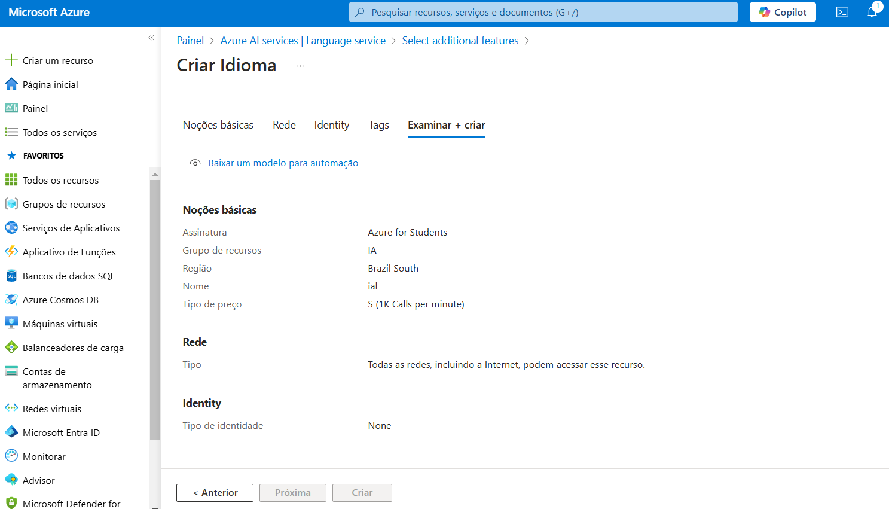
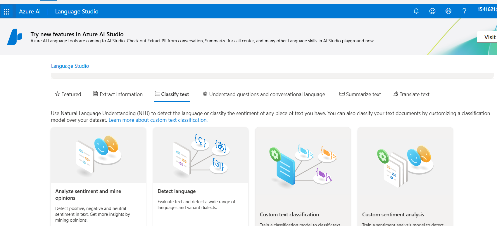
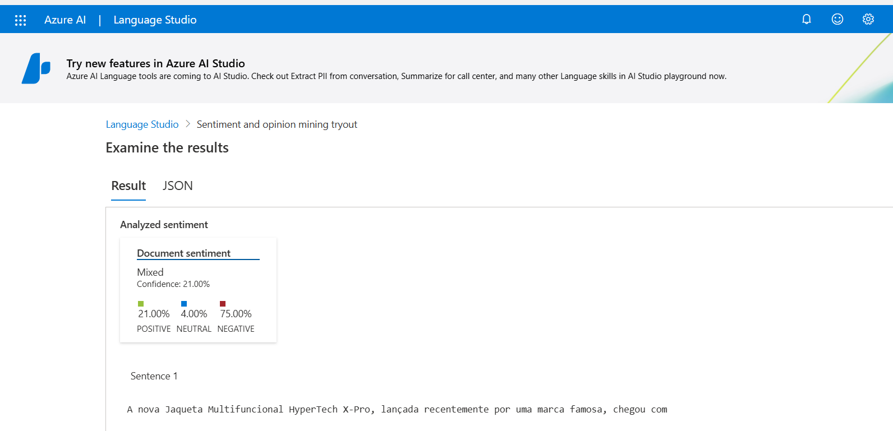

# sentimental_analysis

1 - Esse código é bem similar aos outros. Primeiro criação do grupo de recursos, após isso cria-se o recurso de IA e logo em seguida o serviço de linguagem. 

2 - Cadastramos nosso recurso e escolhemos o tipo. Visitamos a classificação de texto. 

3 - Por último, escolhemos a língua e colocamos o texto que gostaríamos de descobrir a opinião. 

Alguns insights: É um serviço muito interessante, juntamente com o de áudio. Percebi que os serviços de IA seguem sempre o mesmo fluxo. Também achei legal os outputs explicativos que são gerados. A IA é fantástica. 

